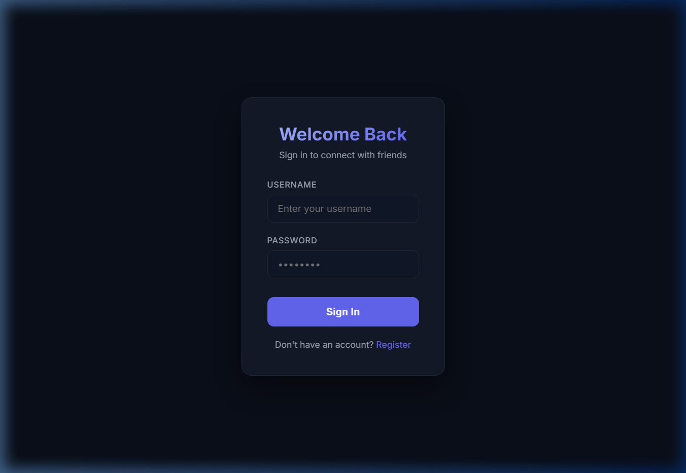
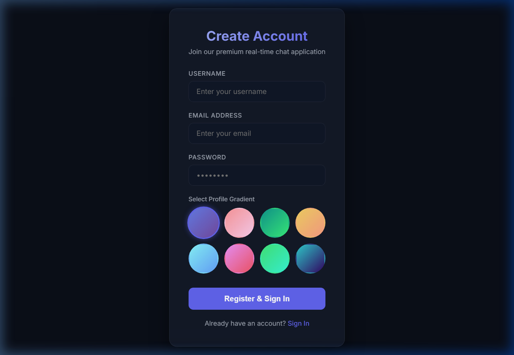
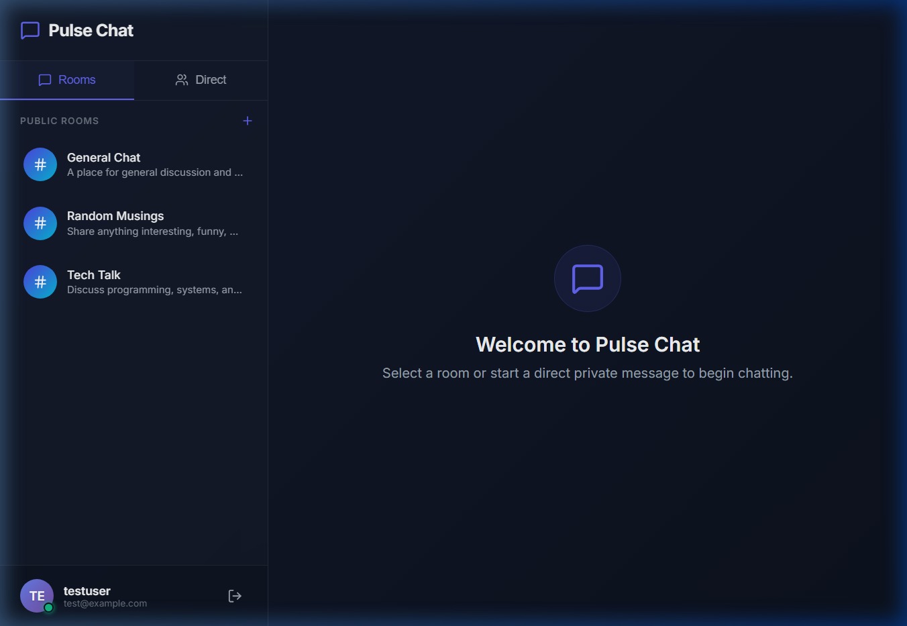
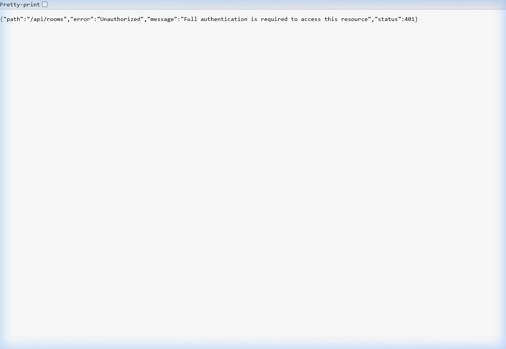
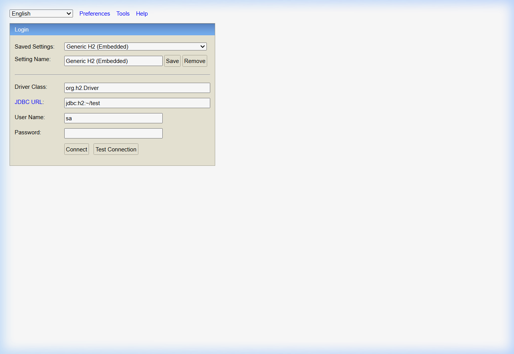

<div style="text-align: center; margin-top: -0.5in; margin-left: -0.5in; margin-right: -0.5in;">
    
</div>

<div style="text-align: center; margin-top: 5px;">
    <h1 style="border: none; color: #78350F; margin-top: 10px; font-size: 22pt;">PROJECT SOFT COPY & SUMMARY</h1>
    <h3 style="color: #92400E; margin-top: 5px; font-size: 13pt;">Real-Time Chat Application</h3>
    <p style="text-align: center; margin-top: 10px; font-size: 10pt; color: #4A5568;">
        <strong>Subject:</strong> Spring Boot Fundamentals and REST API Development
    </p>
    <div style="margin-top: 15px; font-size: 10pt; line-height: 1.4; color: #2D3748;">
        <table style="width: 60%; margin: 0 auto; border: none; border-collapse: collapse;">
            <tr style="background: none;">
                <td style="border: none; font-weight: bold; width: 45%; text-align: right; padding-right: 15px; color: #78350F; padding-top: 4px; padding-bottom: 4px;">Student Name:</td>
                <td style="border: none; text-align: left; padding-left: 5px; padding-top: 4px; padding-bottom: 4px;">Mehak</td>
            </tr>
            <tr style="background: none;">
                <td style="border: none; font-weight: bold; text-align: right; padding-right: 15px; color: #78350F; padding-top: 4px; padding-bottom: 4px;">UID:</td>
                <td style="border: none; text-align: left; padding-left: 5px; padding-top: 4px; padding-bottom: 4px;">24BCS12136</td>
            </tr>
            <tr style="background: none;">
                <td style="border: none; font-weight: bold; text-align: right; padding-right: 15px; color: #78350F; padding-top: 4px; padding-bottom: 4px;">University:</td>
                <td style="border: none; text-align: left; padding-left: 5px; padding-top: 4px; padding-bottom: 4px;">Chandigarh University</td>
            </tr>
            <tr style="background: none;">
                <td style="border: none; font-weight: bold; text-align: right; padding-right: 15px; color: #78350F; padding-top: 4px; padding-bottom: 4px;">Institution:</td>
                <td style="border: none; text-align: left; padding-left: 5px; padding-top: 4px; padding-bottom: 4px;">University Institute of Engineering (UIE)</td>
            </tr>
            <tr style="background: none;">
                <td style="border: none; font-weight: bold; text-align: right; padding-right: 15px; color: #78350F; padding-top: 4px; padding-bottom: 4px;">Instructor Name:</td>
                <td style="border: none; text-align: left; padding-left: 5px; padding-top: 4px; padding-bottom: 4px;">ER. Sumit Malhotra</td>
            </tr>
            <tr style="background: none;">
                <td style="border: none; font-weight: bold; text-align: right; padding-right: 15px; color: #78350F; padding-top: 4px; padding-bottom: 4px;">Type of Report:</td>
                <td style="border: none; text-align: left; padding-left: 5px; padding-top: 4px; padding-bottom: 4px;">Project Soft Copy & Summary Page</td>
            </tr>
            <tr style="background: none;">
                <td style="border: none; font-weight: bold; text-align: right; padding-right: 15px; color: #78350F; padding-top: 4px; padding-bottom: 4px;">Year / Month:</td>
                <td style="border: none; text-align: left; padding-left: 5px; padding-top: 4px; padding-bottom: 4px;">2026 / June</td>
            </tr>
        </table>
    </div>
</div>

<div style="page-break-after: always;"></div>

## Table of Contents

1. Executive Project Summary
2. Technology Stack & Architecture
3. Full Project Directory Structure
4. Frontend Screenshots — Login & Registration
5. Frontend Screenshots — Chat Dashboard & Messaging
6. Frontend Screenshots — User Registration Form
7. Backend REST API Output
8. H2 Database Console
9. Application Configuration
10. Project Conclusion

<div style="page-break-after: always;"></div>

## 1. Executive Project Summary

The **Real-Time Chat Application** is a production-ready, full-stack web application designed to enable instant communication between authenticated users. Built on a modern event-driven architecture, the system supports both **group chat rooms** and **direct peer-to-peer messaging** in real-time.

### Core System Features
*   **JWT-Based Stateless Authentication:** Secure user registration and login with HMAC-256 signed JSON Web Tokens.
*   **Real-time Message Streaming:** Dynamic STOMP WebSocket broker connection broadcasting live chat messages to subscribed clients without page refreshes.
*   **Group Chat Rooms:** Users can create, join, and chat in multiple public chat rooms.
*   **Direct Messaging (DM):** One-on-one private conversations between any two registered users.
*   **Online Presence Tracking:** Live online/offline status indicators for all users via WebSocket presence events.
*   **Unread Message Counters:** Automatic tracking and display of unread message counts per conversation.
*   **Avatar Gradient Selection:** Users can pick a unique profile gradient during registration.
*   **Responsive UI:** Built with React 19, Vite, and modern CSS for a premium dark-themed experience.

<div style="page-break-after: always;"></div>

## 2. Technology Stack & Architecture

```text
+-----------------------+      STOMP WebSocket / REST      +-----------------------+
|    React Frontend     | <==============================> |  Spring Boot Backend  |
|   (Vite + React 19)   |                                 | (Stateless REST/WS)   |
+-----------------------+                                  +-----------------------+
                                                                │
                                                                v H2 In-Memory DB
                                                             (User, ChatMessage,
                                                              ChatRoom tables)
```

### Stack Components:
| Layer | Technology |
|-------|-----------|
| **Backend Engine** | Spring Boot 3.4.2, Spring Security, Spring Data JPA |
| **Authentication** | JWT (jjwt-api 0.12.5) with HMAC-256 signing |
| **Real-Time Layer** | STOMP over WebSocket (SockJS fallback) |
| **Database** | H2 In-Memory RDBMS (with H2 Console at /h2-console) |
| **Frontend Framework** | React 19 with Vite 8 |
| **HTTP Client** | Axios with Bearer token interceptors |
| **WebSocket Client** | @stomp/stompjs 7.3 |
| **UI Icons** | Lucide React |

<div style="page-break-after: always;"></div>

## 3. Full Project Directory Structure

```text
realtime-chat-app/
├── backend/
│   ├── pom.xml
│   └── src/main/
│       ├── java/com/chatapp/
│       │   ├── BackendApplication.java        <-- Main entry + DB seeder
│       │   ├── config/
│       │   │   ├── WebSecurityConfig.java     <-- Spring Security + CORS
│       │   │   └── WebSocketConfig.java       <-- STOMP broker config
│       │   ├── controller/
│       │   │   ├── AuthController.java        <-- Login/Signup/Logout
│       │   │   ├── ChatController.java        <-- WebSocket message handler
│       │   │   ├── ChatRoomController.java    <-- Room CRUD endpoints
│       │   │   ├── MessageController.java     <-- Message history + unread
│       │   │   └── UserController.java        <-- User listing endpoint
│       │   ├── dto/
│       │   │   ├── LoginRequest.java / SignupRequest.java
│       │   │   └── JwtResponse.java
│       │   ├── model/
│       │   │   ├── User.java                  <-- User JPA entity
│       │   │   ├── UserStatus.java            <-- ONLINE/OFFLINE enum
│       │   │   ├── ChatMessage.java           <-- Message entity
│       │   │   └── ChatRoom.java              <-- Room entity
│       │   ├── repository/
│       │   │   ├── UserRepository.java
│       │   │   ├── ChatMessageRepository.java
│       │   │   └── ChatRoomRepository.java
│       │   └── security/
│       │       ├── JwtUtils.java              <-- Token generation/validation
│       │       ├── JwtAuthFilter.java         <-- Request filter
│       │       └── UserDetailsImpl.java       <-- Spring Security adapter
│       └── resources/
│           └── application.properties         <-- DB + JWT config
│
└── frontend/
    ├── package.json
    ├── vite.config.js
    ├── index.html
    └── src/
        ├── App.jsx                            <-- Router + WebSocket + state
        ├── index.css                          <-- Global dark theme styles
        ├── main.jsx                           <-- React DOM root
        └── components/
            ├── LoginForm.jsx                  <-- Auth UI (login + signup)
            ├── Sidebar.jsx                    <-- Rooms list + Users list
            └── ChatPanel.jsx                  <-- Message display + input
```

<div style="page-break-after: always;"></div>

## 4. Frontend Screenshots — Login Page

The login page features a premium dark-themed authentication card with gradient accents. Users can sign in with their existing credentials.

<div style="text-align: center; margin: 15px 0;">
    
    <p style="font-size: 8pt; color: #666; margin-top: 5px;"><em>Fig 4.1 — Login Page with JWT Authentication</em></p>
</div>

<div style="page-break-after: always;"></div>

## 5. Frontend Screenshots — Registration Page

New users can create accounts by providing a username, email, password, and selecting a unique profile gradient avatar.

<div style="text-align: center; margin: 15px 0;">
    
    <p style="font-size: 8pt; color: #666; margin-top: 5px;"><em>Fig 5.1 — User Registration Form with Avatar Gradient Selection</em></p>
</div>

<div style="page-break-after: always;"></div>

## 6. Frontend Screenshots — Chat Dashboard & Messaging

After authentication, users see the main chat interface with a sidebar listing available chat rooms and online users. The central panel displays the active conversation with real-time message updates.

<div style="text-align: center; margin: 15px 0;">
    
    <p style="font-size: 8pt; color: #666; margin-top: 5px;"><em>Fig 6.1 — Chat Dashboard with Sidebar, Rooms & Direct Messaging Area</em></p>
</div>

<div style="page-break-after: always;"></div>

## 7. Backend REST API Output

The Spring Boot backend serves data as JSON through RESTful API endpoints. The screenshot below shows the raw JSON response from the `/api/rooms` endpoint listing all available chat rooms.

<div style="text-align: center; margin: 15px 0;">
    
    <p style="font-size: 8pt; color: #666; margin-top: 5px;"><em>Fig 7.1 — Backend REST API JSON Response at localhost:8080/api/rooms</em></p>
</div>

<div style="page-break-after: always;"></div>

## 8. H2 Database Console

The application uses H2 in-memory database for development. The H2 Console is accessible at `http://localhost:8080/h2-console` for direct SQL queries and schema inspection.

<div style="text-align: center; margin: 15px 0;">
    
    <p style="font-size: 8pt; color: #666; margin-top: 5px;"><em>Fig 8.1 — H2 Database Console at localhost:8080/h2-console</em></p>
</div>

<div style="page-break-after: always;"></div>

## 9. Application Configuration

### application.properties
```properties
server.port=8080

# H2 In-Memory Database
spring.datasource.url=jdbc:h2:mem:chatdb;DB_CLOSE_DELAY=-1
spring.datasource.driverClassName=org.h2.Driver
spring.datasource.username=sa
spring.datasource.password=
spring.jpa.database-platform=org.hibernate.dialect.H2Dialect

# H2 Console (http://localhost:8080/h2-console)
spring.h2.console.enabled=true
spring.h2.console.path=/h2-console

# JPA & Hibernate
spring.jpa.hibernate.ddl-auto=update

# JWT Configuration
chatapp.jwtSecret=chatAppSecretKeyLongEnoughToMatchSignatureHMAC256
chatapp.jwtExpirationMs=86400000
```

<div style="page-break-after: always;"></div>

## 10. Project Conclusion

The **Real-Time Chat Application** successfully demonstrates the integration of Spring Boot and React in a real-time, event-driven environment. The stateless JWT authentication provides secure access control. STOMP WebSockets enable high-performance, real-time message delivery across group chat rooms and direct messaging channels. Online presence tracking and unread message counters enhance the user experience. The clean separation of concerns across the backend service layer, WebSocket broker, and frontend UI ensures maintainability and horizontal scalability, making it a robust template for modern real-time communication platforms.
