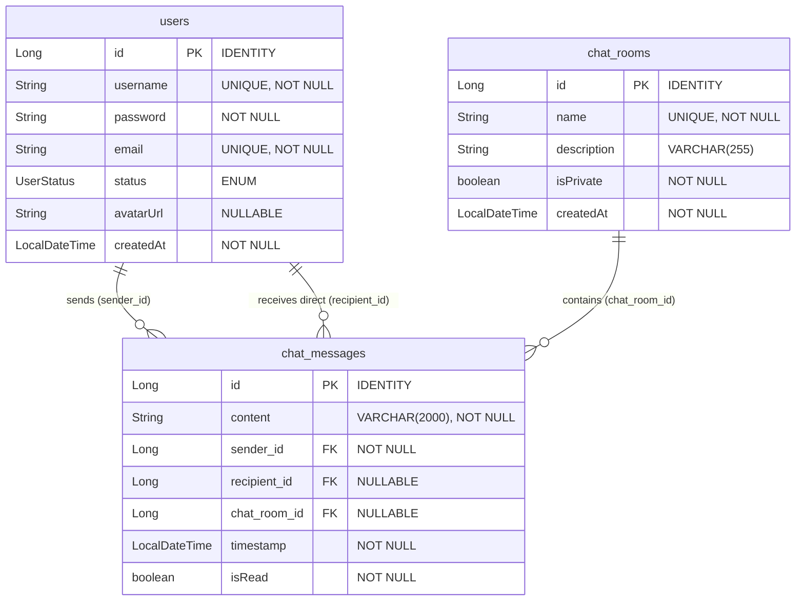

# Weekly Assignment 1: Domain Model, DTOs, Repositories & ER Diagram (Real-Time Chat Application)

This document contains the source code for the **Domain Entities (Models)**, **Data Transfer Objects (DTOs)**, and **Spring Data JPA Repositories** for the Real-Time Chat Application, along with an **Entity-Relationship (ER) Diagram** detailing their database relationships.

---

## 1. Domain Entities (Models)

The domain model represents the core business objects: users (credentials and status), chat rooms (public channels), and chat messages.

### UserStatus.java
Enum representing the presence state of a user.
```java
package com.chatapp.model;

public enum UserStatus {
    ONLINE,
    OFFLINE
}
```

### User.java
Represents a registered user in the messaging system.
```java
package com.chatapp.model;

import com.fasterxml.jackson.annotation.JsonIgnore;
import jakarta.persistence.*;
import jakarta.validation.constraints.Email;
import jakarta.validation.constraints.NotBlank;
import java.time.LocalDateTime;

@Entity
@Table(name = "users", uniqueConstraints = {
        @UniqueConstraint(columnNames = "username"),
        @UniqueConstraint(columnNames = "email")
})
public class User {

    @Id
    @GeneratedValue(strategy = GenerationType.IDENTITY)
    private Long id;

    @NotBlank
    @Column(nullable = false, unique = true)
    private String username;

    @NotBlank
    @JsonIgnore
    @Column(nullable = false)
    private String password;

    @NotBlank
    @Email
    @Column(nullable = false, unique = true)
    private String email;

    @Enumerated(EnumType.STRING)
    private UserStatus status;

    private String avatarUrl;

    private LocalDateTime createdAt;

    public User() {}

    public User(Long id, String username, String password, String email, UserStatus status, String avatarUrl, LocalDateTime createdAt) {
        this.id = id;
        this.username = username;
        this.password = password;
        this.email = email;
        this.status = status;
        this.avatarUrl = avatarUrl;
        this.createdAt = createdAt;
    }

    @PrePersist
    protected void onCreate() {
        createdAt = LocalDateTime.now();
        if (status == null) {
            status = UserStatus.OFFLINE;
        }
    }

    public Long getId() { return id; }
    public void setId(Long id) { this.id = id; }
    public String getUsername() { return username; }
    public void setUsername(String username) { this.username = username; }
    public String getPassword() { return password; }
    public void setPassword(String password) { this.password = password; }
    public String getEmail() { return email; }
    public void setEmail(String email) { this.email = email; }
    public UserStatus getStatus() { return status; }
    public void setStatus(UserStatus status) { this.status = status; }
    public String getAvatarUrl() { return avatarUrl; }
    public void setAvatarUrl(String avatarUrl) { this.avatarUrl = avatarUrl; }
    public LocalDateTime getCreatedAt() { return createdAt; }
    public void setCreatedAt(LocalDateTime createdAt) { this.createdAt = createdAt; }
}
```

### ChatRoom.java
Represents a public messaging room/channel.
```java
package com.chatapp.model;

import jakarta.persistence.*;
import jakarta.validation.constraints.NotBlank;
import java.time.LocalDateTime;

@Entity
@Table(name = "chat_rooms")
public class ChatRoom {

    @Id
    @GeneratedValue(strategy = GenerationType.IDENTITY)
    private Long id;

    @NotBlank
    @Column(nullable = false, unique = true)
    private String name;

    private String description;

    private boolean isPrivate;

    private LocalDateTime createdAt;

    public ChatRoom() {}

    public ChatRoom(Long id, String name, String description, boolean isPrivate, LocalDateTime createdAt) {
        this.id = id;
        this.name = name;
        this.description = description;
        this.isPrivate = isPrivate;
        this.createdAt = createdAt;
    }

    @PrePersist
    protected void onCreate() {
        createdAt = LocalDateTime.now();
    }

    public Long getId() { return id; }
    public void setId(Long id) { this.id = id; }
    public String getName() { return name; }
    public void setName(String name) { this.name = name; }
    public String getDescription() { return description; }
    public void setDescription(String description) { this.description = description; }
    public boolean isPrivate() { return isPrivate; }
    public void setPrivate(boolean isPrivate) { this.isPrivate = isPrivate; }
    public LocalDateTime getCreatedAt() { return createdAt; }
    public void setCreatedAt(LocalDateTime createdAt) { this.createdAt = createdAt; }
}
```

### ChatMessage.java
Represents a single message sent to either a room or a direct user.
```java
package com.chatapp.model;

import jakarta.persistence.*;
import jakarta.validation.constraints.NotBlank;
import java.time.LocalDateTime;

@Entity
@Table(name = "chat_messages")
public class ChatMessage {

    @Id
    @GeneratedValue(strategy = GenerationType.IDENTITY)
    private Long id;

    @NotBlank
    @Column(nullable = false, length = 2000)
    private String content;

    @ManyToOne(fetch = FetchType.EAGER)
    @JoinColumn(name = "sender_id", nullable = false)
    private User sender;

    @ManyToOne(fetch = FetchType.EAGER)
    @JoinColumn(name = "recipient_id")
    private User recipient;

    @ManyToOne(fetch = FetchType.EAGER)
    @JoinColumn(name = "chat_room_id")
    private ChatRoom chatRoom;

    private LocalDateTime timestamp;

    private boolean isRead;

    public ChatMessage() {}

    public ChatMessage(Long id, String content, User sender, User recipient, ChatRoom chatRoom, LocalDateTime timestamp, boolean isRead) {
        this.id = id;
        this.content = content;
        this.sender = sender;
        this.recipient = recipient;
        this.chatRoom = chatRoom;
        this.timestamp = timestamp;
        this.isRead = isRead;
    }

    @PrePersist
    protected void onCreate() {
        timestamp = LocalDateTime.now();
        isRead = false;
    }

    public Long getId() { return id; }
    public void setId(Long id) { this.id = id; }
    public String getContent() { return content; }
    public void setContent(String content) { this.content = content; }
    public User getSender() { return sender; }
    public void setSender(User sender) { this.sender = sender; }
    public User getRecipient() { return recipient; }
    public void setRecipient(User recipient) { this.recipient = recipient; }
    public ChatRoom getChatRoom() { return chatRoom; }
    public void setChatRoom(ChatRoom chatRoom) { this.chatRoom = chatRoom; }
    public LocalDateTime getTimestamp() { return timestamp; }
    public void setTimestamp(LocalDateTime timestamp) { this.timestamp = timestamp; }
    public boolean isRead() { return isRead; }
    public void setRead(boolean read) { isRead = read; }
}
```

---

## 2. Data Transfer Objects (DTOs)

DTOs handle authentication input/output payloads and message transfer signals over WebSocket and HTTP links.

### LoginRequest.java
```java
package com.chatapp.dto;

import jakarta.validation.constraints.NotBlank;

public class LoginRequest {
    @NotBlank
    private String username;

    @NotBlank
    private String password;

    public LoginRequest() {}
    public LoginRequest(String username, String password) {
        this.username = username;
        this.password = password;
    }
    public String getUsername() { return username; }
    public void setUsername(String username) { this.username = username; }
    public String getPassword() { return password; }
    public void setPassword(String password) { this.password = password; }
}
```

### SignupRequest.java
```java
package com.chatapp.dto;

import jakarta.validation.constraints.Email;
import jakarta.validation.constraints.NotBlank;
import jakarta.validation.constraints.Size;

public class SignupRequest {
    @NotBlank
    @Size(min = 3, max = 20)
    private String username;

    @NotBlank
    @Size(min = 6, max = 40)
    private String password;

    @NotBlank
    @Email
    private String email;

    private String avatarUrl;

    public SignupRequest() {}
    public SignupRequest(String username, String password, String email, String avatarUrl) {
        this.username = username;
        this.password = password;
        this.email = email;
        this.avatarUrl = avatarUrl;
    }
    public String getUsername() { return username; }
    public void setUsername(String username) { this.username = username; }
    public String getPassword() { return password; }
    public void setPassword(String password) { this.password = password; }
    public String getEmail() { return email; }
    public void setEmail(String email) { this.email = email; }
    public String getAvatarUrl() { return avatarUrl; }
    public void setAvatarUrl(String avatarUrl) { this.avatarUrl = avatarUrl; }
}
```

### JwtResponse.java
```java
package com.chatapp.dto;

public class JwtResponse {
    private String token;
    private String type = "Bearer";
    private Long id;
    private String username;
    private String email;
    private String avatarUrl;

    public JwtResponse() {}
    public JwtResponse(String token, Long id, String username, String email, String avatarUrl) {
        this.token = token;
        this.id = id;
        this.username = username;
        this.email = email;
        this.avatarUrl = avatarUrl;
    }
    public String getToken() { return token; }
    public void setToken(String token) { this.token = token; }
    public String getType() { return type; }
    public void setType(String type) { this.type = type; }
    public Long getId() { return id; }
    public void setId(Long id) { this.id = id; }
    public String getUsername() { return username; }
    public void setUsername(String username) { this.username = username; }
    public String getEmail() { return email; }
    public void setEmail(String email) { this.email = email; }
    public String getAvatarUrl() { return avatarUrl; }
    public void setAvatarUrl(String avatarUrl) { this.avatarUrl = avatarUrl; }
}
```

### MessageDto.java
```java
package com.chatapp.dto;

import java.time.LocalDateTime;

public class MessageDto {
    private Long id;
    private String content;
    private String senderUsername;
    private String senderAvatar;
    private String recipientUsername;
    private Long chatRoomId;
    private LocalDateTime timestamp;
    private boolean isRead;

    public MessageDto() {}
    public MessageDto(Long id, String content, String senderUsername, String senderAvatar, String recipientUsername, Long chatRoomId, LocalDateTime timestamp, boolean isRead) {
        this.id = id;
        this.content = content;
        this.senderUsername = senderUsername;
        this.senderAvatar = senderAvatar;
        this.recipientUsername = recipientUsername;
        this.chatRoomId = chatRoomId;
        this.timestamp = timestamp;
        this.isRead = isRead;
    }
    public Long getId() { return id; }
    public void setId(Long id) { this.id = id; }
    public String getContent() { return content; }
    public void setContent(String content) { this.content = content; }
    public String getSenderUsername() { return senderUsername; }
    public void setSenderUsername(String senderUsername) { this.senderUsername = senderUsername; }
    public String getSenderAvatar() { return senderAvatar; }
    public void setSenderAvatar(String senderAvatar) { this.senderAvatar = senderAvatar; }
    public String getRecipientUsername() { return recipientUsername; }
    public void setRecipientUsername(String recipientUsername) { this.recipientUsername = recipientUsername; }
    public Long getChatRoomId() { return chatRoomId; }
    public void setChatRoomId(Long chatRoomId) { this.chatRoomId = chatRoomId; }
    public LocalDateTime getTimestamp() { return timestamp; }
    public void setTimestamp(LocalDateTime timestamp) { this.timestamp = timestamp; }
    public boolean isRead() { return isRead; }
    public void setRead(boolean read) { isRead = read; }

    public static class MessageDtoBuilder {
        private final MessageDto dto = new MessageDto();
        public MessageDtoBuilder id(Long id) { dto.setId(id); return this; }
        public MessageDtoBuilder content(String content) { dto.setContent(content); return this; }
        public MessageDtoBuilder senderUsername(String senderUsername) { dto.setSenderUsername(senderUsername); return this; }
        public MessageDtoBuilder senderAvatar(String senderAvatar) { dto.setSenderAvatar(senderAvatar); return this; }
        public MessageDtoBuilder recipientUsername(String recipientUsername) { dto.setRecipientUsername(recipientUsername); return this; }
        public MessageDtoBuilder chatRoomId(Long chatRoomId) { dto.setChatRoomId(chatRoomId); return this; }
        public MessageDtoBuilder timestamp(LocalDateTime timestamp) { dto.setTimestamp(timestamp); return this; }
        public MessageDtoBuilder isRead(boolean isRead) { dto.setRead(isRead); return this; }
        public MessageDto build() { return dto; }
    }
    public static MessageDtoBuilder builder() { return new MessageDtoBuilder(); }
}
```

---

## 3. Repositories

### UserRepository.java
```java
package com.chatapp.repository;

import com.chatapp.model.User;
import org.springframework.data.jpa.repository.JpaRepository;
import org.springframework.stereotype.Repository;
import java.util.List;
import java.util.Optional;

@Repository
public interface UserRepository extends JpaRepository<User, Long> {
    Optional<User> findByUsername(String username);
    Boolean existsByUsername(String username);
    Boolean existsByEmail(String email);
    List<User> findAllByOrderByUsernameAsc();
}
```

### ChatRoomRepository.java
```java
package com.chatapp.repository;

import com.chatapp.model.ChatRoom;
import org.springframework.data.jpa.repository.JpaRepository;
import org.springframework.stereotype.Repository;
import java.util.List;
import java.util.Optional;

@Repository
public interface ChatRoomRepository extends JpaRepository<ChatRoom, Long> {
    Optional<ChatRoom> findByName(String name);
    List<ChatRoom> findAllByOrderByNameAsc();
}
```

### ChatMessageRepository.java
```java
package com.chatapp.repository;

import com.chatapp.model.ChatMessage;
import org.springframework.data.jpa.repository.JpaRepository;
import org.springframework.data.jpa.repository.Modifying;
import org.springframework.data.jpa.repository.Query;
import org.springframework.data.repository.query.Param;
import org.springframework.stereotype.Repository;
import org.springframework.transaction.annotation.Transactional;
import java.util.List;

@Repository
public interface ChatMessageRepository extends JpaRepository<ChatMessage, Long> {

    List<ChatMessage> findByChatRoomIdOrderByTimestampAsc(Long chatRoomId);

    @Query("SELECT m FROM ChatMessage m WHERE " +
           "(m.sender.id = :u1 AND m.recipient.id = :u2) OR " +
           "(m.sender.id = :u2 AND m.recipient.id = :u1) " +
           "ORDER BY m.timestamp ASC")
    List<ChatMessage> findDirectMessages(@Param("u1") Long u1, @Param("u2") Long u2);

    @Query("SELECT COUNT(m) FROM ChatMessage m WHERE " +
           "m.sender.id = :senderId AND m.recipient.id = :recipientId AND m.isRead = false")
    long countUnreadMessages(@Param("senderId") Long senderId, @Param("recipientId") Long recipientId);

    @Modifying
    @Transactional
    @Query("UPDATE ChatMessage m SET m.isRead = true WHERE " +
           "m.sender.id = :senderId AND m.recipient.id = :recipientId AND m.isRead = false")
    void markAsRead(@Param("senderId") Long senderId, @Param("recipientId") Long recipientId);
}
```

---

## 4. Entity-Relationship (ER) Diagram

Below is the database relationship schema drawn in Mermaid, showing the mappings between the JPA entities:



### Relationship Explanation:
1. **User to ChatMessage (1:N Sends)**: One user can send multiple chat messages (`sender_id` foreign key referencing the `users` table). A message has exactly one sender.
2. **User to ChatMessage (1:N Receives Direct)**: One user can receive multiple direct messages as a recipient (`recipient_id` foreign key referencing the `users` table, which is null for public room messages).
3. **ChatRoom to ChatMessage (1:N Contains)**: A chat room can contain multiple messages (`chat_room_id` foreign key referencing `chat_rooms` table, which is null for direct private messages).
