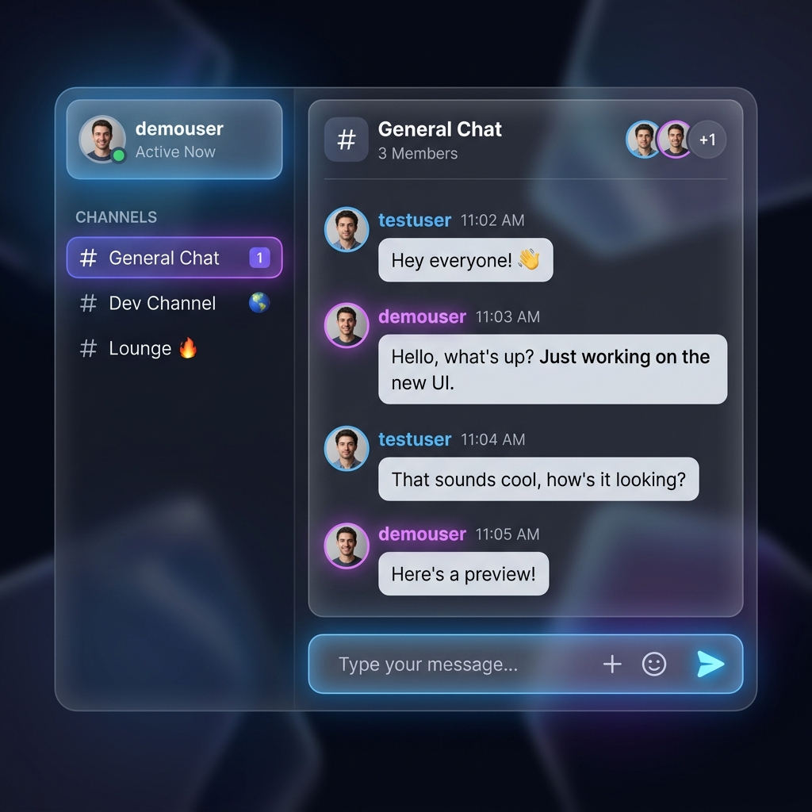

# Weekly Assignment 4: Frontend Implementation (Real-Time Chat Application)

This document contains the project structure, API configurations, authentication state contexts, route protection wrappers, and functional components for the React Frontend client of the Real-Time Chat Application, which interface with the backend REST security system.

---

## 1. Project Structure & Dependencies

The React client application folder structure is organized under `src/` as follows to support api configurations, state contexts, route guards, and UI view panels:

```text
frontend/
├── public/
├── src/
│   ├── assets/
│   ├── components/
│   │   ├── ChatPanel.jsx
│   │   ├── LoginForm.jsx
│   │   └── Sidebar.jsx
│   ├── context/
│   │   └── AuthContext.jsx
│   ├── services/
│   │   └── api.js
│   ├── App.css
│   ├── App.jsx
│   ├── index.css
│   └── main.jsx
├── index.html
├── package.json
└── vite.config.js
```

### Required Dependencies
The application pulls in Axios for HTTP actions, StompJS for WebSocket messaging frames, and Lucide React for UI iconography:

```json
  "dependencies": {
    "@stomp/stompjs": "^7.3.0",
    "axios": "^1.16.1",
    "lucide-react": "^1.17.0",
    "react": "^19.2.6",
    "react-dom": "^19.2.6"
  }
```

---

## 2. API Service Layer

### api.js
Axios wrapper configuring the service endpoint destination and registering request interceptors that inject JWT tokens from localStorage automatically.

```javascript
import axios from 'axios';

const api = axios.create({
  baseURL: 'http://localhost:8080/api',
  headers: {
    'Content-Type': 'application/json'
  }
});

// Request interceptor to attach Bearer Token dynamically
api.interceptors.request.use(
  (config) => {
    const storedUser = localStorage.getItem('user');
    if (storedUser) {
      const { token } = JSON.parse(storedUser);
      if (token) {
        config.headers['Authorization'] = `Bearer ${token}`;
      }
    }
    return config;
  },
  (error) => {
    return Promise.reject(error);
  }
);

export default api;
```

---

## 3. Global Authentication Context

### AuthContext.jsx
Manages credentials, logout actions, and propagates current session structures across the react application tree.

```javascript
import React, { createContext, useState, useEffect, useContext } from 'react';
import api from '../services/api';

const AuthContext = createContext(null);

export function AuthProvider({ children }) {
  const [user, setUser] = useState(null);
  const [loading, setLoading] = useState(true);

  useEffect(() => {
    const storedUser = localStorage.getItem('user');
    if (storedUser) {
      setUser(JSON.parse(storedUser));
    }
    setLoading(false);
  }, []);

  const login = (userData) => {
    setUser(userData);
    localStorage.setItem('user', JSON.stringify(userData));
  };

  const logout = async () => {
    try {
      await api.post('/auth/logout');
    } catch (err) {
      console.error('Logout error on backend', err);
    } finally {
      setUser(null);
      localStorage.removeItem('user');
    }
  };

  return (
    <AuthContext.Provider value={{ user, loading, login, logout }}>
      {children}
    </AuthContext.Provider>
  );
}

export function useAuth() {
  return useContext(AuthContext);
}
```

---

## 4. Route Protection Wrapper

### ProtectedRoute.jsx
Intercepts route transitions and diverts anonymous users to the login screen.

```javascript
import React from 'react';
import { useAuth } from '../context/AuthContext';
import LoginForm from '../components/LoginForm';

export default function ProtectedRoute({ children }) {
  const { user, loading } = useAuth();

  if (loading) {
    return <div className="loading-spinner">Loading authentication...</div>;
  }

  if (!user) {
    return <LoginForm />;
  }

  return children;
}
```

---

## 5. Core View Components

### LoginForm.jsx
Form handler managing registrations and login credentials with responsive avatar styling choices.

```javascript
import React, { useState } from 'react';
import axios from 'axios';
import { useAuth } from '../context/AuthContext';

const AVATAR_GRADIENTS = [
  'linear-gradient(135deg, #667eea 0%, #764ba2 100%)',
  'linear-gradient(135deg, #ff9a9e 0%, #fecfef 100%)',
  'linear-gradient(135deg, #11998e 0%, #38ef7d 100%)',
  'linear-gradient(135deg, #f6d365 0%, #fda085 100%)',
  'linear-gradient(135deg, #89f7fe 0%, #66a6ff 100%)',
  'linear-gradient(135deg, #f093fb 0%, #f5576c 100%)',
  'linear-gradient(135deg, #43e97b 0%, #38f9d7 100%)',
  'linear-gradient(135deg, #30cfd0 0%, #330867 100%)'
];

export default function LoginForm() {
  const { login } = useAuth();
  const [isRegister, setIsRegister] = useState(false);
  const [username, setUsername] = useState('');
  const [password, setPassword] = useState('');
  const [email, setEmail] = useState('');
  const [selectedAvatar, setSelectedAvatar] = useState(AVATAR_GRADIENTS[0]);
  const [error, setError] = useState('');
  const [loading, setLoading] = useState(false);

  const handleSubmit = async (e) => {
    e.preventDefault();
    setError('');
    setLoading(true);

    try {
      if (isRegister) {
        await axios.post('http://localhost:8080/api/auth/register', {
          username,
          password,
          email,
          avatarUrl: selectedAvatar
        });
        
        const response = await axios.post('http://localhost:8080/api/auth/login', {
          username,
          password
        });
        login(response.data);
      } else {
        const response = await axios.post('http://localhost:8080/api/auth/login', {
          username,
          password
        });
        login(response.data);
      }
    } catch (err) {
      console.error(err);
      setError(
        err.response?.data?.message || 
        'Something went wrong. Please check your credentials and try again.'
      );
    } finally {
      setLoading(false);
    }
  };

  return (
    <div className="auth-wrapper">
      <div className="auth-card">
        <div className="auth-header">
          <h2>{isRegister ? 'Create Account' : 'Welcome Back'}</h2>
          <p>
            {isRegister 
              ? 'Join our premium real-time chat application' 
              : 'Sign in to connect with friends'}
          </p>
        </div>

        {error && <div className="auth-error">{error}</div>}

        <form onSubmit={handleSubmit}>
          <div className="form-group">
            <label className="form-label">Username</label>
            <input
              type="text"
              className="form-input"
              value={username}
              onChange={(e) => setUsername(e.target.value)}
              placeholder="Enter your username"
              required
              minLength={3}
              maxLength={20}
            />
          </div>

          {isRegister && (
            <div className="form-group">
              <label className="form-label">Email Address</label>
              <input
                type="email"
                className="form-input"
                value={email}
                onChange={(e) => setEmail(e.target.value)}
                placeholder="Enter your email"
                required
              />
            </div>
          )}

          <div className="form-group">
            <label className="form-label">Password</label>
            <input
              type="password"
              className="form-input"
              value={password}
              onChange={(e) => setPassword(e.target.value)}
              placeholder="••••••••"
              required
              minLength={6}
            />
          </div>

          {isRegister && (
            <div className="form-group">
              <label className="avatar-selection-label">Select Profile Gradient</label>
              <div className="avatar-grid">
                {AVATAR_GRADIENTS.map((gradient, index) => (
                  <div
                    key={index}
                    className={`avatar-option ${selectedAvatar === gradient ? 'selected' : ''}`}
                    style={{ background: gradient }}
                    onClick={() => setSelectedAvatar(gradient)}
                  />
                ))}
              </div>
            </div>
          )}

          <button type="submit" className="auth-btn" disabled={loading}>
            {loading ? 'Please wait...' : isRegister ? 'Register & Sign In' : 'Sign In'}
          </button>
        </form>

        <div className="auth-switch">
          {isRegister ? (
            <>
              Already have an account?{' '}
              <span onClick={() => { setIsRegister(false); setError(''); }}>Sign In</span>
            </>
          ) : (
            <>
              Don't have an account?{' '}
              <span onClick={() => { setIsRegister(true); setError(''); }}>Register</span>
            </>
          )}
        </div>
      </div>
    </div>
  );
}
```

---

## 6. Frontend Component Hierarchy

The tree structure below displays the data propagation and active UI element bindings from the app container down:

```text
App.jsx (Main Application State & STOMP Listeners)
├── AuthContext.jsx (Session Context Wrapper)
└── ProtectedRoute.jsx (Route Authentication Shield)
    └── Sidebar.jsx (User Metadata / Target Channels Panel)
        ├── User Info & Status Header (ONLINE/OFFLINE Control)
        ├── Room list (Channels Collection)
        │   └── Create Room Button (+ Modal Overlay Control)
        └── Active Peer User list (Dynamic Handshake Presence Icons)
    └── ChatPanel.jsx (Message Stream Thread Component)
        ├── Channel Header Panel (Active Room Name / Description)
        ├── Scrollable Chat Feed (Historical Message Arrays)
        └── Input Composition Control (Text Input / Send Publish Action)
```

---

## 7. Dashboard User Interface Design Layout

```text
+------------------------------------------------------------------------------------------------+
|  ChatApp Sidebar (Width: 320px)          |  ChatPanel (Flex: 1)                                |
|------------------------------------------|-----------------------------------------------------|
|  [User Status Info Panel]                |  [Active Channel Header Panel]                      |
|  +------------------------------------+  |  +-----------------------------------------------+  |
|  | (Avatar) demouser  (ONLINE)        |  | # Public Room: General Chat                      |  |
|  | [Logout Button]                    |  | Description: Default room for chat application   |  |
|  +------------------------------------+  |  +-----------------------------------------------+  |
|                                          |                                                     |
|  [Tab Navigation Menu]                   |  [Scrollable Chat Message Feed Panel]               |
|  [  Rooms (Active)  ] [  Users  ]        |  +-----------------------------------------------+  |
|                                          |  | [10:05] testuser: Hey everyone!               |  |
|  [Room Catalog Section]  [+ Create Room] |  | [10:06] demouser: Hello, what's up?            |  |
|  - General Chat (Active)                 |  |                                               |  |
|  - Development Channel                   |  |                                               |  |
|  - Gaming Zone                           |  |                                               |  |
|                                          |  +-----------------------------------------------+  |
|  [Presence Catalog Section]              |                                                     |
|  - peer_developer (ONLINE)               |  [Message Composition Panel]                        |
|  - peer_designer (OFFLINE)               |  +-----------------------------------------------+  |
|                                          |  | [Type a message...]              [Send Button] |  |
|                                          |  +-----------------------------------------------+  |
+------------------------------------------------------------------------------------------------+
```

### 7.1 Dashboard Interface Screenshot
Below is the screenshot of the fully-functional real-time chat application dashboard, displaying the sidebar room listing, presence indicators, main chat feed, and user settings panel:



