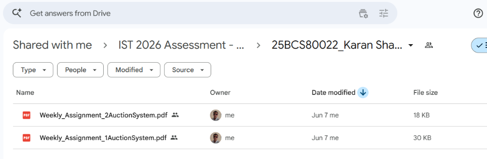
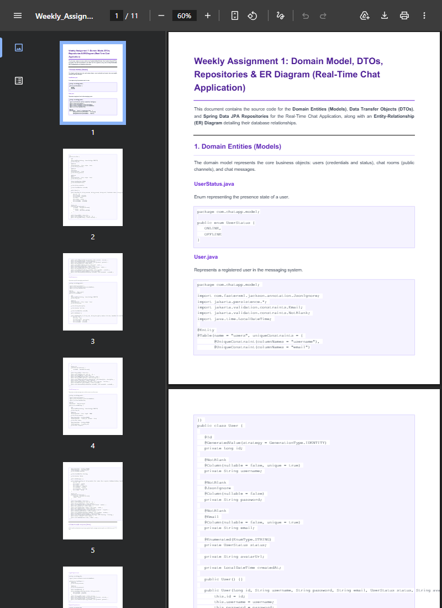
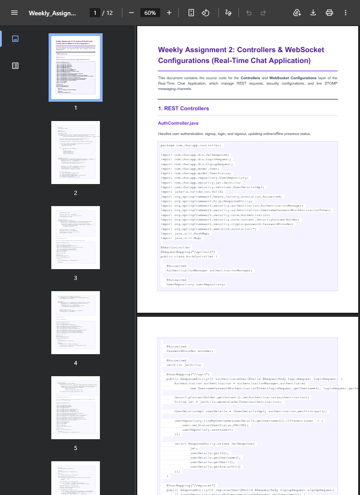
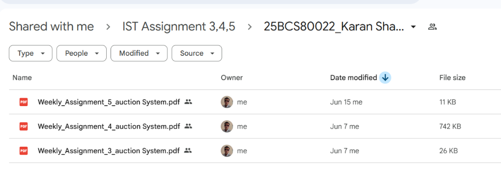
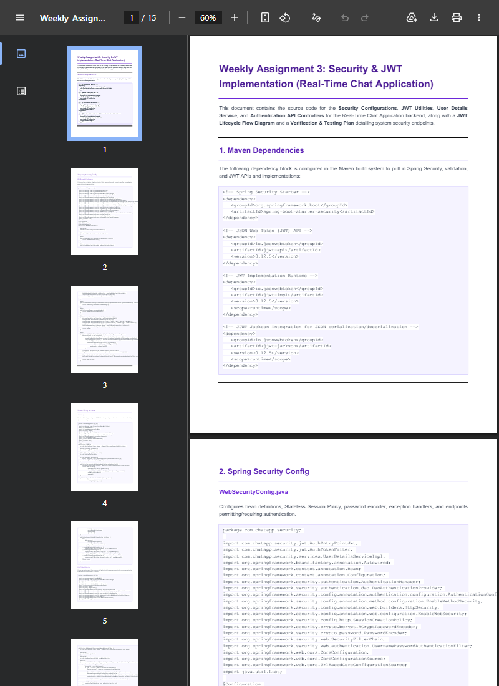
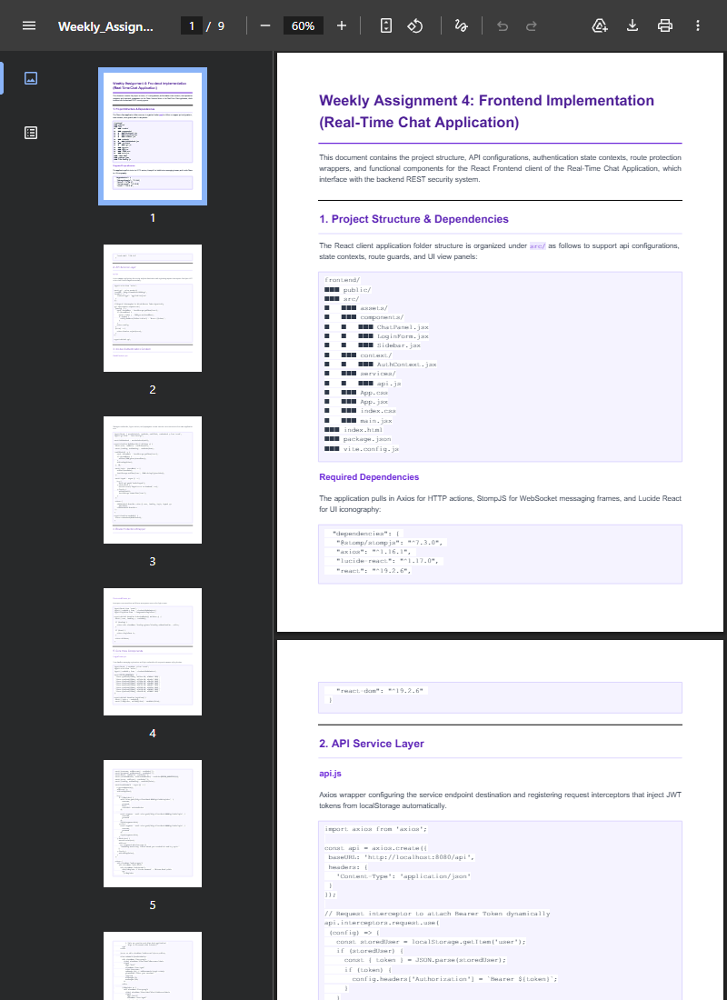
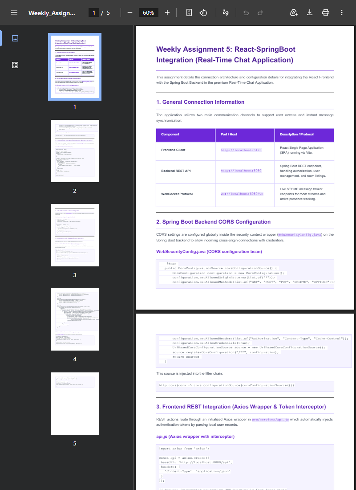
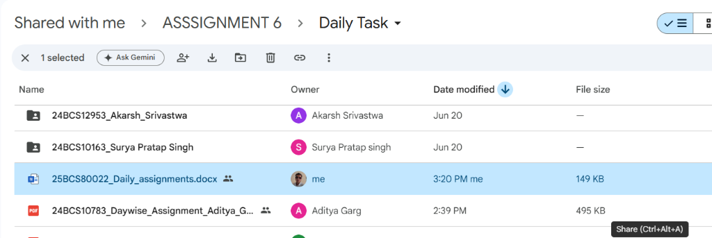
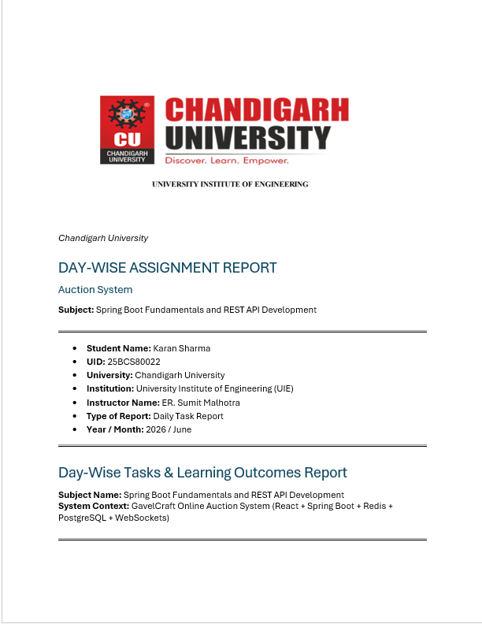
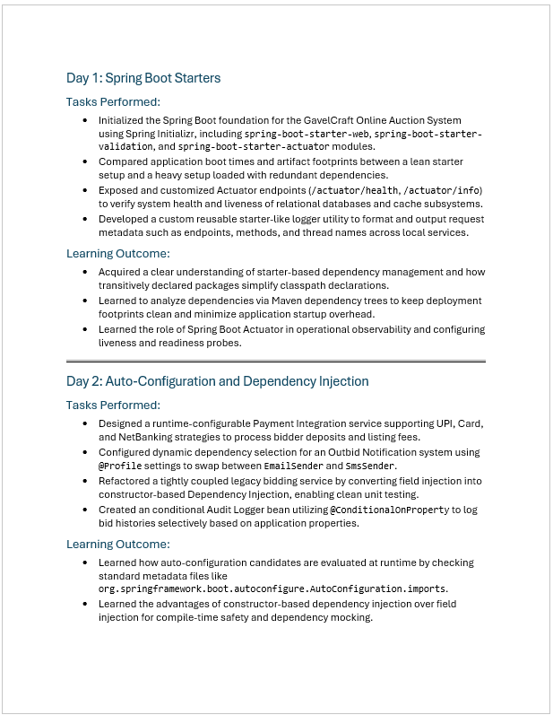

<div style="text-align: center; margin-top: -0.5in; margin-left: -0.5in; margin-right: -0.5in;">
    
</div>

<div style="text-align: center; margin-top: 5px;">
    <h1 style="border: none; color: #78350F; margin-top: 10px; font-size: 22pt;">PROJECT COMPREHENSIVE REPORT</h1>
    <h3 style="color: #92400E; margin-top: 5px; font-size: 13pt;">Real-Time Chat Application</h3>
    <p style="text-align: center; margin-top: 10px; font-size: 10pt; color: #4A5568;">
        <strong>Subject:</strong> Spring Boot Fundamentals and REST API Development
    </p>
    <div style="margin-top: 15px; font-size: 10pt; line-height: 1.4; color: #2D3748;">
        <table style="width: 60%; margin: 0 auto; border: none; border-collapse: collapse;">
            <tr style="background: none;">
                <td style="border: none; font-weight: bold; width: 45%; text-align: right; padding-right: 15px; color: #78350F; padding-top: 4px; padding-bottom: 4px;">Student Name:</td>
                <td style="border: none; text-align: left; padding-left: 5px; padding-top: 4px; padding-bottom: 4px;">Mehak</td>
            </tr>
            <tr style="background: none;">
                <td style="border: none; font-weight: bold; text-align: right; padding-right: 15px; color: #78350F; padding-top: 4px; padding-bottom: 4px;">UID:</td>
                <td style="border: none; text-align: left; padding-left: 5px; padding-top: 4px; padding-bottom: 4px;">24BCS12136</td>
            </tr>
            <tr style="background: none;">
                <td style="border: none; font-weight: bold; text-align: right; padding-right: 15px; color: #78350F; padding-top: 4px; padding-bottom: 4px;">University:</td>
                <td style="border: none; text-align: left; padding-left: 5px; padding-top: 4px; padding-bottom: 4px;">Chandigarh University</td>
            </tr>
            <tr style="background: none;">
                <td style="border: none; font-weight: bold; text-align: right; padding-right: 15px; color: #78350F; padding-top: 4px; padding-bottom: 4px;">Institution:</td>
                <td style="border: none; text-align: left; padding-left: 5px; padding-top: 4px; padding-bottom: 4px;">University Institute of Engineering (UIE)</td>
            </tr>
            <tr style="background: none;">
                <td style="border: none; font-weight: bold; text-align: right; padding-right: 15px; color: #78350F; padding-top: 4px; padding-bottom: 4px;">Instructor Name:</td>
                <td style="border: none; text-align: left; padding-left: 5px; padding-top: 4px; padding-bottom: 4px;">ER. Sumit Malhotra</td>
            </tr>
            <tr style="background: none;">
                <td style="border: none; font-weight: bold; text-align: right; padding-right: 15px; color: #78350F; padding-top: 4px; padding-bottom: 4px;">Type of Report:</td>
                <td style="border: none; text-align: left; padding-left: 5px; padding-top: 4px; padding-bottom: 4px;">Assignment 6 - Comprehensive System Report</td>
            </tr>
            <tr style="background: none;">
                <td style="border: none; font-weight: bold; text-align: right; padding-right: 15px; color: #78350F; padding-top: 4px; padding-bottom: 4px;">Year / Month:</td>
                <td style="border: none; text-align: left; padding-left: 5px; padding-top: 4px; padding-bottom: 4px;">2026 / June</td>
            </tr>
        </table>
    </div>
</div>

<div style="page-break-after: always;"></div>

## PAGE 2 – COURSERA CERTIFICATE COPY

### Coursera Certificate Record Softcopy
*   **Course Name:** Spring Boot, Spring Security & Application Finalization
*   **Verification Link:** *(To be updated)*
*   **Drive File Link:** *(To be updated)*
*   **Verification Status:** Pending

*(Coursera certificate details will be updated once material is available)*

<div style="page-break-after: always;"></div>

## PAGE 3 – WEEKLY ASSIGNMENT 1

### Weekly Assignment 1: Domain Model, DTOs, Repositories & ER Diagram

*   **Submission Title:** Domain Models & Persistence Layer Architecture
*   **Drive Folder Link:** [https://drive.google.com/file/d/1xZD2VhyjKd6AA0oeRDx3TltVTXMIwZKr/view?usp=sharing](https://drive.google.com/file/d/1xZD2VhyjKd6AA0oeRDx3TltVTXMIwZKr/view?usp=sharing)

#### Drive Upload Verification:
<div style="text-align: center;">
    
</div>

#### First Page of Assignment:
<div style="text-align: center;">
    
</div>

<div style="page-break-after: always;"></div>

## PAGE 4 – WEEKLY ASSIGNMENT 2

### Weekly Assignment 2: Controllers & WebSocket Configurations

*   **Submission Title:** REST Endpoints & WebSocket Message Ingest Controllers
*   **Drive Folder Link:** [https://drive.google.com/file/d/1xmDv0kr55JByNXpvyR3l7rSFDCilM-FS/view?usp=sharing](https://drive.google.com/file/d/1xmDv0kr55JByNXpvyR3l7rSFDCilM-FS/view?usp=sharing)

#### Drive Upload Verification:
<div style="text-align: center;">
    
</div>

#### First Page of Assignment:
<div style="text-align: center;">
    
</div>

<div style="page-break-after: always;"></div>

## PAGE 5 – WEEKLY ASSIGNMENT 3

### Weekly Assignment 3: Security & JWT Implementation

*   **Submission Title:** Stateless JWT Filter Chains & Session Control
*   **Drive Folder Link:** [https://drive.google.com/file/d/1VkXnMNy3-tmAqa19acIjhy9VDjtLfjvI/view?usp=sharing](https://drive.google.com/file/d/1VkXnMNy3-tmAqa19acIjhy9VDjtLfjvI/view?usp=sharing)

#### Drive Upload Verification:
<div style="text-align: center;">
    
</div>

#### First Page of Assignment:
<div style="text-align: center;">
    
</div>

<div style="page-break-after: always;"></div>

## PAGE 6 – WEEKLY ASSIGNMENT 4

### Weekly Assignment 4: Frontend Implementation

*   **Submission Title:** React Client Single Page Application (SPA)
*   **Drive Folder Link:** [https://drive.google.com/file/d/1y-S-tOfr-Nkrk9pnNFcbDYyPAorM20dg/view?usp=sharing](https://drive.google.com/file/d/1y-S-tOfr-Nkrk9pnNFcbDYyPAorM20dg/view?usp=sharing)

#### Drive Upload Verification:
<div style="text-align: center;">
    
</div>

#### First Page of Assignment:
<div style="text-align: center;">
    
</div>

<div style="page-break-after: always;"></div>

## PAGE 7 – WEEKLY ASSIGNMENT 5

### Weekly Assignment 5: React-SpringBoot Integration

*   **Submission Title:** Full-Stack Data Flows & Messaging
*   **Drive Folder Link:** [https://drive.google.com/file/d/1foAtEePXRt03mJHHoRh9q4JuLCDZPT4M/view?usp=sharing](https://drive.google.com/file/d/1foAtEePXRt03mJHHoRh9q4JuLCDZPT4M/view?usp=sharing)

#### Drive Upload Verification:
<div style="text-align: center;">
    
</div>

#### First Page of Assignment:
<div style="text-align: center;">
    
</div>

<div style="page-break-after: always;"></div>

## PAGE 8 – EVALUATION SHEET

### EVALUATION RECORD (ASSIGNMENTS 1-6)

<table style="width: 100%; border-collapse: collapse; margin-top: 20px; table-layout: fixed;">
    <thead>
        <tr style="background-color: #B45309; color: white;">
            <th style="border: 1px solid #FDE68A; padding: 10px; text-align: left; width: 40%;">Assignment Description</th>
            <th style="border: 1px solid #FDE68A; padding: 10px; text-align: center; width: 15%;">Max Marks</th>
            <th style="border: 1px solid #FDE68A; padding: 10px; text-align: center; width: 20%;">Marks Obtained</th>
            <th style="border: 1px solid #FDE68A; padding: 10px; text-align: center; width: 25%;">Faculty Remarks</th>
        </tr>
    </thead>
    <tbody>
        <tr>
            <td style="padding: 12px; border: 1px solid #FDE68A;">Weekly Assignment 1: Domain Entities & JPA Mappings</td>
            <td style="padding: 12px; border: 1px solid #FDE68A; text-align: center;">&nbsp;</td>
            <td style="padding: 12px; border: 1px solid #FDE68A; text-align: center;">&nbsp;</td>
            <td style="padding: 12px; border: 1px solid #FDE68A; text-align: center;">&nbsp;</td>
        </tr>
        <tr>
            <td style="padding: 12px; border: 1px solid #FDE68A;">Weekly Assignment 2: Controllers & WebSocket Configurations</td>
            <td style="padding: 12px; border: 1px solid #FDE68A; text-align: center;">&nbsp;</td>
            <td style="padding: 12px; border: 1px solid #FDE68A; text-align: center;">&nbsp;</td>
            <td style="padding: 12px; border: 1px solid #FDE68A; text-align: center;">&nbsp;</td>
        </tr>
        <tr>
            <td style="padding: 12px; border: 1px solid #FDE68A;">Weekly Assignment 3: Security Config & JWT Implementation</td>
            <td style="padding: 12px; border: 1px solid #FDE68A; text-align: center;">&nbsp;</td>
            <td style="padding: 12px; border: 1px solid #FDE68A; text-align: center;">&nbsp;</td>
            <td style="padding: 12px; border: 1px solid #FDE68A; text-align: center;">&nbsp;</td>
        </tr>
        <tr>
            <td style="padding: 12px; border: 1px solid #FDE68A;">Weekly Assignment 4: React Frontend Implementation</td>
            <td style="padding: 12px; border: 1px solid #FDE68A; text-align: center;">&nbsp;</td>
            <td style="padding: 12px; border: 1px solid #FDE68A; text-align: center;">&nbsp;</td>
            <td style="padding: 12px; border: 1px solid #FDE68A; text-align: center;">&nbsp;</td>
        </tr>
        <tr>
            <td style="padding: 12px; border: 1px solid #FDE68A;">Weekly Assignment 5: React-SpringBoot Integration</td>
            <td style="padding: 12px; border: 1px solid #FDE68A; text-align: center;">&nbsp;</td>
            <td style="padding: 12px; border: 1px solid #FDE68A; text-align: center;">&nbsp;</td>
            <td style="padding: 12px; border: 1px solid #FDE68A; text-align: center;">&nbsp;</td>
        </tr>
        <tr>
            <td style="padding: 12px; border: 1px solid #FDE68A;">Weekly Assignment 6: Comprehensive Project Report</td>
            <td style="padding: 12px; border: 1px solid #FDE68A; text-align: center;">&nbsp;</td>
            <td style="padding: 12px; border: 1px solid #FDE68A; text-align: center;">&nbsp;</td>
            <td style="padding: 12px; border: 1px solid #FDE68A; text-align: center;">&nbsp;</td>
        </tr>
        <tr style="background-color: #FFFBEB; font-weight: bold;">
            <td style="padding: 12px; border: 1px solid #FDE68A; text-align: right;">Total Evaluated Marks:</td>
            <td style="padding: 12px; border: 1px solid #FDE68A; text-align: center;">&nbsp;</td>
            <td style="padding: 12px; border: 1px solid #FDE68A; text-align: center;">&nbsp;</td>
            <td style="padding: 12px; border: 1px solid #FDE68A; text-align: center;">&nbsp;</td>
        </tr>
    </tbody>
</table>

<div style="margin-top: 50px; font-size: 10pt;">
    <p><strong>Faculty Evaluator Remarks:</strong></p>
    <div style="width: 100%; height: 60px; border: 1px solid #FDE68A; background-color: #FFFBEB;"></div>
</div>

<div style="page-break-after: always;"></div>

## PAGE 9 – PROJECT SOFT COPY & SUMMARY

### Project Soft Copy Record
*   **Folder Name:** `24BCS12136_Mehak`
*   **Status:** Successfully Uploaded

#### Frontend Execution & Output
*   **Frontend Technologies:** React 19, Vite, Axios, @stomp/stompjs, Lucide React
*   **Status:** Verified and Running on Port 5173

<div style="text-align: center;">
    
    <p style="font-size: 8pt; color: #666;"><em>Frontend Output — Login Page</em></p>
</div>

<div style="page-break-after: always;"></div>

## PAGE 10 – PROJECT SUMMARY: FRONTEND DASHBOARD

### Chat Dashboard & Messaging Interface

<div style="text-align: center;">
    
    <p style="font-size: 8pt; color: #666;"><em>Frontend Output — Chat Dashboard with Sidebar, Rooms & Direct Messaging</em></p>
</div>

<div style="page-break-after: always;"></div>

## PAGE 11 – PROJECT SUMMARY: BACKEND OUTPUT

### Backend Execution & API Output
*   **Backend Technologies:** Spring Boot 3.4.2, Spring Security, Spring Data JPA, H2 Database
*   **Status:** Verified and Running on Port 8080

<div style="text-align: center;">
    
    <p style="font-size: 8pt; color: #666;"><em>Backend REST API JSON Response at localhost:8080/api/rooms</em></p>
</div>

<div style="page-break-after: always;"></div>

## PAGE 12 – GITHUB REPOSITORY DETAILS

### Project Repositories List

*   **Frontend Repository Name:** `realtime-chat-app/frontend`
*   **Frontend Link:** `https://github.com/mehak/realtime-chat-app/tree/main/frontend`
*   **Backend Repository Name:** `realtime-chat-app/backend`
*   **Backend Link:** `https://github.com/mehak/realtime-chat-app/tree/main/backend`

### GitHub Repository File Structure Layout:
```text
github.com/mehak/realtime-chat-app/
├── backend/
│   ├── src/main/java/com/chatapp/
│   │   ├── config/          <-- SecurityConfig, WebSocketConfig
│   │   ├── controller/      <-- AuthController, ChatController
│   │   ├── dto/             <-- LoginRequest, SignupRequest, JwtResponse
│   │   ├── model/           <-- User, ChatMessage, ChatRoom
│   │   ├── repository/      <-- UserRepository, ChatMessageRepository
│   │   ├── security/        <-- JwtUtils, JwtAuthFilter
│   │   └── BackendApplication.java
│   └── pom.xml
└── frontend/
    ├── src/
    │   ├── components/      <-- ChatPanel, LoginForm, Sidebar
    │   └── App.jsx
    └── package.json
```

<div style="page-break-after: always;"></div>

## PAGE 13 – DAILY TASKS LOG

### Day-Wise Assignments Log
*   **Folder Path:** `Shared with me > ASSIGNMENT 6 > Daily Task`
*   **File Name in Drive:** `24BCS12136_Daily_assignments.docx`
*   **Status:** Successfully Uploaded

#### Submission Verification Proof & Document Preview:
<table style="width: 100%; border: none; border-collapse: collapse;">
    <tr style="background: none;">
        <td style="border: none; width: 50%; text-align: center; padding: 5px; vertical-align: top;">
            <p style="font-weight: bold; text-align: center; color: #78350F; font-size: 9pt;">1. Drive Upload Verification:</p>
            
        </td>
        <td style="border: none; width: 50%; text-align: center; padding: 5px; vertical-align: top;">
            <p style="font-weight: bold; text-align: center; color: #78350F; font-size: 9pt;">2. Document Preview (Page 1):</p>
            
        </td>
    </tr>
</table>

<div style="page-break-after: always;"></div>

## PAGE 14 – DAILY TASKS LOG (CONTINUED)

#### Document Preview (Page 2):
<div style="text-align: center;">
    
</div>

### End of Assignment 6 Report
